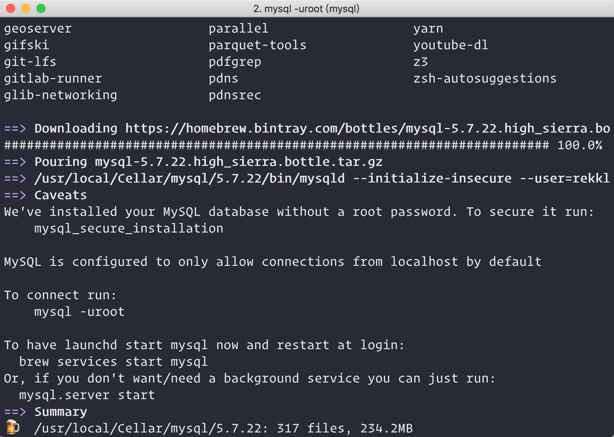

### DB

   Mac 安装Mysql
   
        brew install mysql
        
    
   
   Mysql安全配置(设置密码，移除匿名用户，删除测试DB)
        
        mysql_secure_installation
   
   启动Mysql   
   
        mysql.service start
              

   客户端只有Mac，Win找找是否有对应的。
   
   Mysql：
   
   [Sequel Pro](http://www.sequelpro.com/) 
   
   简单粗暴，界面美观不多说，缺点是只支持Mysql
   
   
   
   [Table Plus](https://tableplus.io/) 
   
   大杀器，支持的DB从关系型到NoSQL都行，界面美观，功能完善
   
   