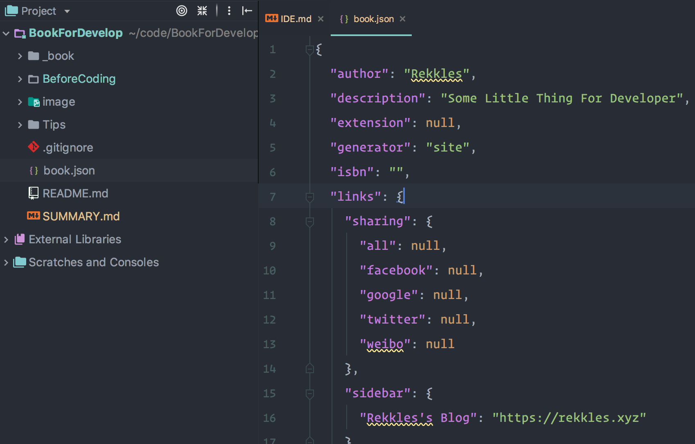

### IDE
  这里只介绍jetbrain家族的ide，vscode、sublime和其他的ide用的少，自己琢磨。
  
  配色方案：
  
  **`Setting -> Plugin -> Browse Repositories`**
  
  搜索 
  
  **`Material Theme UI`**
  
  install之后Restart可以看到效果，Mac推荐使用 
  
  **`Atom One Dark`**
  
  字体：
  
  **`Operate Mono`**
  
  收费字体，想使用的自己购买或者找破解，这里不提供破解字体。
  
  插件：
  
  **`Waka Time`** 
  
  可以记录你每天的Coding时间并记录成图表，适用范围很广，[地址](https://wakatime.com/dashboard)
  
  效果图
  